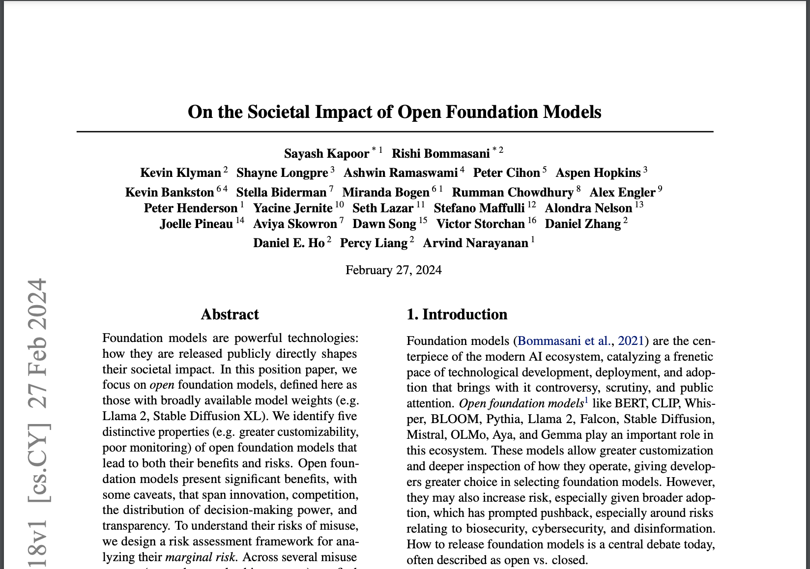
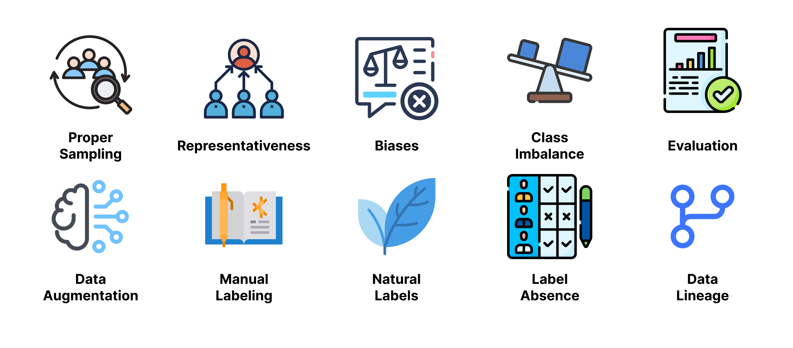

# 📄 Task 1 - Article Analysis

**Objective**: Critically analyze the article from Arxiv https://arxiv.org/pdf/2403.07918.pdf, deliberating on the sharing of models in ML, examining both the favorable aspects and the drawbacks.

  

## 🟩 Positive

The sharing of open-source foundation models brings a plethora of benefits to both the developer community and end-users. Primarily, these models offer the possibility to specify acceptability bounds for model behavior, which is crucial in contexts where there is access to sensitive data and interpersonal communication. Furthermore, by providing greater accessibility and customization, these models stimulate innovation, enabling developers to adjust models according to specific needs, including adapting them to proprietary datasets without privacy concerns. Such customization can drive advancements in various domains, such as improving support for different languages. Additionally, they accelerate scientific research, making it more accessible and customizable, which is essential for ensuring scientific reproducibility and enabling deeper investigation and external scrutiny. Promoting transparency is another significant aspect, allowing researchers, auditors, and journalists to examine base models more thoroughly, contributing to responsible innovation and public accountability. Lastly, sharing open-source foundation models helps mitigate monoculture and market concentration, favoring greater customization and reducing risks associated with cultural homogenization. This promotes healthier competition in downstream markets, aiding in reducing market concentration and risks linked to excessive reliance on a single model.

## 🟥 Negative

According to the article, analyzing the risks associated with open-source foundation models requires a systematic and comprehensive approach, considering various threat vectors. Among these risks, concerns related to biosafety, cybersecurity, and the potential for different forms of abuse stand out, such as voice cloning scams, targeted phishing, and the spread of misinformation. Additionally, there is concern about the misuse of these models for creating and disseminating non-consensual intimate images and material related to child sexual abuse. It is essential to contextualize these risks within the pre-existing landscape, assessing the challenges already present in society before the introduction of open-source foundation models, as well as the defenses currently in place against these risks. This understanding provides a conceptual basis for evaluating the additional risk associated with these models, determining whether they duplicate existing risks, introduce new risks, or if existing defenses are insufficient to address these new challenges. Anticipating the evolution of defenses against these emerging risks is equally important, considering the possibility of implementing new defense strategies or adapting existing ones to confront the increased global risk. However, it is crucial to recognize the uncertainties and underlying assumptions in this risk analysis, acknowledging that many past studies may have incomplete analyses in this regard.

## 🟦 Personal

Open-source foundational models represent a substantial advancement in the democratization of artificial intelligence and machine learning. Their accessibility provides opportunities for a wide range of developers, including researchers and entrepreneurs, aiming to create customized and innovative solutions. Transparency regarding biases present in the models is essential, requiring developers to have a comprehensive understanding and a commitment to mitigating these biases to ensure fairness and justice in their applications. Independence from private companies that charge for model usage not only reduces associated costs but also preserves data privacy, allowing for on-premises deployment of models without the need to send sensitive data to external servers. Additionally, the advantage of an extensive open-source community is the ability to identify and fix bugs in diverse and rapid ways, potentially resulting in more effective solutions than those offered by proprietary solutions.

# 📘 Task 2 - Key Points on Training Data

**Objective**: Extract and summarize 10 crucial insights about Training Data from Chapter 4 of Chip Huyen's book, __Designing Machine Learning Systems__.

In a scenario where the application of machine learning techniques is becoming increasingly common, the issue of data quality becomes paramount. Chapter 4 of the book "Designing Machine Learning Systems" by Chip Huyen addresses a series of crucial points related to data manipulation and preparation for machine learning models. From proper sample selection to handling label absence, each discussed aspect emphasizes the importance of having quality data to obtain robust and reliable models. In this regard, the following 10 points offer a brief overview of the main topics covered in this chapter, outlining the importance of sampling, representativeness, bias treatment, and other essential techniques for the success of a machine learning system.

  

**Proper Sampling**: Sampling technique is of fundamental importance, as it is not always feasible or practical to work with all available data, either due to collection limitations or even the time required to perform all processing. In this sense, choosing the appropriate sampling method is important to ensure that the captured sample accurately represents the population or the original dataset.

There are two families of sampling methods, probabilistic and non-probabilistic. The non-probabilistic family is named as such because it does not use any probability-based criteria for sampling and, therefore, tends to be non-representative and contain biases. Popular methods in this family include:

- Convenience sampling: Samples are selected based on their availability.
- Snowball sampling: Future samples are selected based on existing samples.
- Judgment sampling: Experts decide which samples to include.
- Quota sampling: Samples are selected based on quotas for certain data slices without any randomization.

Probabilistic methods are named as such because they use probability concepts in data sampling. Popular methods in this family include:

- Simple Random Sampling: All samples in the population have the same probability of being chosen.
- Stratified Sampling: Seeks to divide the population into groups and perform sampling based on these groups.
- Weighted Sampling: Each sample is assigned a weight, determining the probability of its selection.
- Reservoir Sampling: Ideal for handling data streaming, it creates a reservoir of k samples from the population in a way that no samples that have been selected previously are included.
- Importance Sampling: Selects samples from a probability distribution different from the original population distribution but weighted according to the importance of observations. This is useful in situations where the original distribution is difficult to sample directly, but an importance distribution may be easier to sample or manipulate.

**Representativeness**: A sample is considered representative when it can, with a smaller number, accurately represent the population, a larger group. Representativeness is important to ensure that conclusions and models built from the sample are generalizable and applicable to the broader context.

A non-representative sample can introduce biases and distortions into the results, leading to erroneous conclusions and biased models. For example, if a sample contains an unbalanced proportion of a certain class or group, the machine learning model trained with that sample will tend to favor that class in its predictions.

**Biases**: Biases are systematic tendencies in the data that can distort conclusions and machine learning models. These tendencies can arise from various sources, including class imbalances, data collection failures, and biases embedded in the data or algorithms. Imbalanced classes, for example, are a common source of bias in the data. When one class is significantly more prevalent than others, the machine learning model tends to favor that class in its predictions, to the detriment of less represented classes.

Identifying and mitigating biases in the data is essential to ensure fairness, equity, and accuracy in machine learning models. For this purpose, there is a dedicated area for the study of imbalanced class treatment.

**Treatment of imbalanced classes**: This is a common problem in datasets where one or more classes have significantly fewer samples compared to other classes. This can lead to machine learning models that are biased towards the majority classes and have difficulty generalizing to the minority classes.

In the book, the author presents some strategies to address this problem, such as resampling techniques like oversampling (creating synthetic copies of minority class samples) and undersampling (removing samples from the majority class) to balance the distribution of classes, and adjustments in the model's cost function to penalize errors in samples from minority classes more significantly.

**Performance Evaluation in Imbalanced Datasets**: When evaluating models trained on imbalanced datasets, performance metrics such as precision, recall, F1-score, and AUC-ROC are more suitable as they take into account the unequal distribution of classes. Metrics such as accuracy and error rate are inadequate in this case as they treat all classes equally, meaning that the model's performance on the majority class will dominate these metrics.

**Data Augmentation**: It is a technique used to expand the existing dataset by creating artificial variations in the training data. This is especially useful in small or imbalanced datasets where the variety of examples is limited.

In the book, the author highlights three main techniques:

- Simple Label-Preserving Transformations: Involves simple transformations on the data that preserve the original class or category of the samples. For example, in computer vision tasks, rotations, mirroring, resizing, and cropping can be applied to images without altering their underlying class. These modifications introduce realistic variations that do not change the interpretation or label of the samples. This helps the model learn more robust and generalizable features, reducing the risk of overfitting on limited datasets.
- Perturbation: Involves introducing small changes to existing data to create new training instances. These changes may include adding noise, mild distortion to the data, or slight variations in attributes. It is particularly useful for increasing the model's robustness to small variations in input data, making it more capable of handling noise and unforeseen variations in test data.
- Data Synthesis: Involves generating new data samples from models or statistical distributions that represent the original dataset. These synthetic samples are designed to be similar to real samples but are not directly observed in the original data. Among the approaches to data synthesis, techniques based on generative models stand out, such as generative adversarial networks (GANs) and Gaussian mixture models. These techniques can generate synthetic samples that capture the statistical and structural characteristics of real data but may introduce some artificial variability. It is useful when there is a shortage of training examples or when one wishes to explore regions of the data space that are not represented by existing examples. However, it is important to ensure that synthetic samples are realistically distributed and representative of the true data space.

**Manual Labeling**: Manual labeling is a laborious and costly process in which humans manually assign labels or categories to data samples. Although it is a precise approach, it is impractical or unfeasible in large datasets due to the time and effort required. This technique is often employed in tasks where label quality is crucial and cannot be easily automated. For example, in medical image classification problems, where correct identification of features can be vital for diagnosis, or in text categorization in specific contexts, where subtle nuances may be important for correct classification. Despite the challenges associated with manual labeling, it remains a common practice in many areas, especially when accuracy is paramount and other sources of labels are unreliable or unavailable.

**Natural Labels**: Refer to intrinsic information or indicators present in the data itself that can be used as labels or supervision signals in machine learning tasks. For example, in sentiment analysis of texts, emoticons, certain keywords, or even specific linguistic expressions can serve as natural labels to determine the sentiment expressed in the text. These indicators are inherent to the data and do not require manual intervention to assign labels. The use of natural labels can significantly reduce the need for manual labeling and facilitate the training process of models on large datasets. This is especially useful in scenarios where manual labeling would be impractical due to the volume of data or the complexity of the tasks. However, it is important to ensure that natural labels are reliable and representative of the true context of the machine learning task.

**Dealing with Label Absence**: Handling label absence is a common challenge in many machine learning tasks, especially when manual labeling is costly, time-consuming, or impractical. There are several approaches to address this issue:

- Weak Supervision: This approach involves using imprecise or partial labels to train models. Although the labels are less reliable, they can still provide useful information for model training.

- Semi-Supervised Learning: This approach leverages both labeled and unlabeled data for training. This allows the model to learn from a limited amount of labels and utilize additional information from the unlabeled data.

- Active Learning: In this iterative process, the model requests labels for specific samples that it deems most informative. This enables more efficient use of manual labeling resources by focusing on the most useful samples to improve model performance.

- Transfer Learning: This approach utilizes knowledge acquired from previous tasks to improve performance in a new task, often requiring fewer labels for training. The model pretrained on a related task can be fine-tuned for the new task with a smaller set of labeled data.

These approaches are useful for handling datasets with label absence and can significantly improve the efficiency of the model training process, especially in scenarios where manual labeling is impractical.

**Data Lineage**: The process of tracking the origin of each data sample and its labels. This is essential for identifying biases in the data and debugging machine learning models. Maintaining a record of data lineage helps identify the cause of model performance issues, such as a drop in accuracy after adding new data. One can investigate whether the cause lies in the quality of the new data, labeling processes, or other factors such as biases introduced by annotators. Having a clear understanding of data lineage is crucial to avoid mysterious model failures and ensure the reliability and robustness of machine learning systems. This can also be useful for audits and regulatory compliance, providing transparency on how models were trained and the data used.

The chapter presents a series of strategies and considerations to ensure data quality in machine learning systems. From the selection of representative samples to tracking the origin of data, each discussed topic highlights the need for careful and systematic approaches in data handling. The understanding and proper application of these concepts not only improve model performance but also contribute to the reliability and interpretability of the results obtained. By implementing the practices suggested in this chapter, machine learning professionals will be better equipped to deal with the inherent challenges in data preparation and manipulation, thus ensuring the construction of more effective and reliable systems.

# 🎥 Task 3 - MLOps Zoomcamp Exploration

**Objective**: Explore and provide insights on Week 2 of the MLOps Zoomcamp course available on [Github](https://github.com/DataTalksClub/mlops-zoomcamp/tree/main/02-experiment-tracking)

   

  <a href="https://github.com/DataTalksClub/mlops-zoomcamp/tree/main" target="_blank">
    Source: MLOps Zoomcamp (2024)
  </a> 

The course begins by presenting some important concepts within the area of Machine Learning Operations (MLOps) such as experiments and artifacts. Next, he delves deeper into these concepts, highlighting their importance and presenting the MLFlow tool. MLflow is an open-source platform for managing the end-to-end machine learning lifecycle. It's designed to help organizations streamline their machine learning workflows, from experimentation to production deployment, by providing tools for experiment tracking, model management, and collaboration. Below are insights into each aspect of MLflow:

1. **Experiment Tracking**:
   - MLflow allows users to track experiments by recording parameters, metrics, and output files for each run.
   - It provides a centralized location for storing and comparing experiments, making it easier to understand the impact of different parameters and techniques.
   - Experiment tracking enables reproducibility by capturing the environment and dependencies of each run.

2. **Model Management**:
   - MLflow provides tools for managing and versioning machine learning models.
   - Users can easily package their models as reusable artifacts and deploy them in various environments.
   - Model management features facilitate collaboration among data scientists and engineers by enabling them to share and reproduce models.

3. **Model Registry**:
   - MLflow's Model Registry is a feature for managing the lifecycle of machine learning models.
   - It allows users to register, version, and store models along with their metadata and lineage information.
   - It facilitates governance and compliance by providing audit trails and access controls.

4. **Limitations**:
   - While MLflow offers a comprehensive set of features for managing the machine learning lifecycle, it may not cover all use cases or integrate seamlessly with every tool or environment.
   - Users may encounter challenges when deploying models to certain production environments or integrating MLflow with existing infrastructure.
   - MLflow's Model Registry is relatively new and may lack some advanced features found in more mature model management platforms.

5. **Benefits**:
   - MLflow simplifies the process of developing, training, and deploying machine learning models by providing a unified platform with built-in experiment tracking, model management, and collaboration tools.
   - It promotes best practices for reproducibility and collaboration by capturing the complete lifecycle of machine learning projects, from data preparation to model deployment.
   - MLflow is an open-source project with a large and active community, which means users can benefit from ongoing development, contributions, and support from the community.
