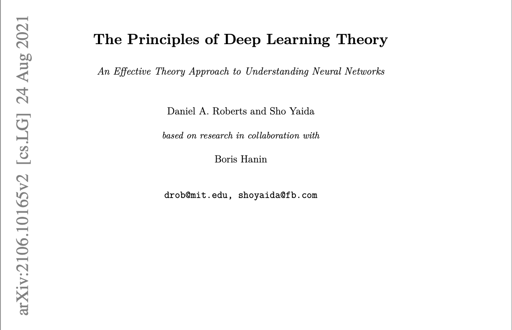

# :bulb: :book: The Principles of Deep Learning Theory

- :books: The Principles of Deep Learning Theory [[Link]](https://arxiv.org/pdf/2106.10165.pdf)

> __Main Concepts__: Identify and explain the primary ideas and theories presented in the chapter. Focus on the fundamental principles of deep learning theory as discussed by the authors.

> __Theoretical Implications__: Critically analyze how these concepts contribute to our understanding of deep neural networks. Consider the implications of the effective theory approach and the focus on intuitive understanding over formal calculations.

> __Critical Evaluation__: Provide your own perspective on the strengths and limitations of the approaches and theories discussed.

  

## Main Concepts

The author of the book divide the understanding of deep neural networks into microscopic and macroscopic concepts. The microscopic aspect entails a set of instructions for transforming an input through multiple layers of components into an output. Throughout the training process, these components become highly adjusted, and knowledge of these specific adjustments is necessary for a system to produce useful results. Conversely, the macroscopic aspect focuses on the entire process, from the data used as input for the model to learn to recognize those data through the approximation of a function to the final outcome of the model's prediction.

To comprehend these two realms, the author initiates the discussion with theoretical physics, specifically thermodynamics and statistical mechanics, physical theories that jointly elucidate, from first microscopic principles, the macroscopic behavior of systems with many elementary constituents. Some of the concepts presented are outlined below:

- __Neural Networks__: Despite being somewhat based on biological neural networks, artificial neural networks consist of a set of building blocks called neurons, which together can perform various tasks flexibly.

- __Neurons__: These are the computational units that comprise neural networks. Mathematically, a neuron is a simple function that considers a weighted sum of received signals and then fires in a characteristic manner, comparing the value of this sum with some threshold.

- __Layers__: These are arrays of neurons organized in parallel.

- __Deep Neural Networks__: These are composed of multiple layers arranged sequentially.

With these concepts in mind, the author proceeds to a more mathematical explanation. Initially, they propose considering the neural network as a parameterized function that takes an input $x$ and a vector $\theta$ containing a large number of parameters to control the shape of this function. For this function to adapt to the desired problem, i.e., to approximate the target function, it needs to initialize the parameters randomly and adjust them. This concept is known as approximation function, where the data are trained in a learning algorithm to achieve the best possible outcome.

In seeking to understand the macroscopic behavior of this function from the microscopic description, the author performs a Taylor series expansion of this function around the initialized points. Through this, three technical issues are identified: the infinite number of terms in the function; randomness in sampling the parameter vector at each initialization, resulting in different functions in these initializations; and the complexity of training, where the values of the learned parameters are not unique, resulting from an iterative process with nonlinear dynamics.

To attempt to address these problems specifically for neural network functions in an intuitive manner, the author employs the principle of sparsity. Essentially, a neural network can grow in two ways: by increasing its width while keeping its depth fixed, or by increasing its depth while keeping its width fixed. When calculating the growth limit tending to infinity, known as the infinite-width limit, a trained distribution is found to approximate a Gaussian distribution, simplifying the analysis. However, this approach is not physically viable, so the quest is for a way to study the interactions between neurons in a network of finite size such that the corrections become small when the width is large. To achieve this, perturbation theory is used, with a $1/n$ expansion to calculate the distribution, resulting in an almost Gaussian distribution that resembles a more realistic neural network and can be used as a minimal theoretical model for understanding deep learning.

## Theoretical Implications

The concepts examined by the author contribute to an intuitive understanding of how neural networks operate. In particular, the concepts from thermodynamics and statistical mechanics aid in a more theoretical understanding of macroscopic behavior from the microscopic level. Meanwhile, the Taylor series expansion and perturbation theory contribute to understanding neural network operations from a simpler and more intuitive model. Through this, the author has demonstrated the limitations and issues that simplifying the model has resulted in for achieving the desired understanding.

## Critical Evaluation

The author's approach in providing an intuitive understanding of neural network functioning, rather than solely focusing on mathematical aspects and implementation, is relevant. Often, a lack of understanding about internal mechanisms can be a significant gap, especially when the focus is on obtaining practical results in neural network implementation. This approach allows for knowledge assimilation in a distinct manner compared to more traditional approaches, which typically begin with formal and technical definitions.

However, a potential drawback of this approach is that it may seem slow to readers seeking a direct and concise understanding of neural network concepts. Nonetheless, in a machine learning engineering learning journey, developing a solid intuition on the subject, as addressed by the author in Chapter 0, can be crucial.

# :blue_book: Task 2

> __Objective__: Summarize the essential points from Chapter 5, emphasizing the main strategies and techniques for feature engineering highlighted by the author. From your reading, distill the most critical best practices for feature engineering. Explain why these practices are important and how they contribute to the success of a machine learning model.

  

- :books: The Principles of Deep Learning Theory [[Link]](https://arxiv.org/pdf/2106.10165.pdf)

In Chapter 5 of the book "Designing Machine Learning Systems," Chip Huyen discusses best practices and important considerations regarding feature engineering.

### Learned Features Vs Engineered Features

__Key Takeaways__: Engineered Features are manually designed by data scientists, while Learned Features are automatically extracted by models. In the context of natural language processing (NLP) and computer vision, techniques such as stopword removal, lemmatization, and n-gram creation exemplify Feature Engineering. On the other hand, Learned Features can be observed in deep learning models, where characteristics such as information extraction from convolutional layers in raw images occur automatically. Although Learned Features are predominant in deep learning, most models in production are still based on machine learning, highlighting the ongoing importance of Feature Engineering.

__Best Practices__: It is important to have domain knowledge and machine learning expertise to choose the best features and create new features for the machine learning model. Additionally, understanding the theory behind how models extract useful information from features is important for preprocessing efficiently and creating increasingly better features.

__How this technique can contribute to the success of a machine learning model?__ Enhancing the quality of features, whether learned or engineered, contributes to the improvement of the machine learning model.

### Handling Missing Values

__Key Takeaways__: There isn't just one type of missing value; there are three, and the treatment for each type differs.

- Missing Not at Random (MNAR): values are missing due to the value itself, meaning the probability of a value being missing is influenced by the actual value of the variable in question. The author cites an example where people who did not disclose their incomes tend to have higher incomes. Therefore, the absence of income values is related to the income values themselves.
- Missing at Random (MAR): Values are missing not due to the value itself but due to another observed variable. The author gives an example where individuals of a certain gender do not like to disclose their age. Therefore, the absence of age values is influenced by another variable, in this case, gender.
- Missing Completely at Random (MCAR): The absence of values does not exhibit a discernible pattern. The author uses an example where people did not fill in the "Occupation" column. In this case, the absence of occupation values is completely random, unrelated to the occupation itself or any other observed variable. However, she highlights that this type of absence is quite rare in practice. Usually, there are specific reasons for missing values, and it is recommended to investigate these reasons to better understand the data.

To handle missing values, they can be imputed or removed.

__Best Practices__: According to the author, some best practices for handling missing values include imputation and deletion of data. It is important to note that each method has its advantages and disadvantages, so there is no perfect solution.

- Imputation: This technique involves manually imputing missing values. She highlights two common practices: filling categorical columns with an empty string ("") and numeric columns with the mean, median, or mode. Both practices work well in many cases, but they are not perfect and can sometimes cause issues. There is a risk of introducing bias and adding noise to the data, or worse, data leakage.

- Deletion: There are two main forms of deletion: column deletion and row deletion. The former removes the entire variable if it has a large number of missing values. However, this may result in the loss of important information and reduced model accuracy. Meanwhile, the latter removes the entire sample if it has missing values. This may be suitable if the missing values are completely random (MCAR) and the number of samples with missing values is small.

__How this technique can contribute to the success of a machine learning model?__ Handling missing values is important because models cannot deal with null values. In practice, there will be missing data, and it is necessary to know how to handle it, as some features are crucial for the models. However, depending on the number of missing samples, deletion may remove important information and reduce model accuracy.

### Scaling

__Key Takeaways__: Feature scaling is the process of scaling features into similar intervals before inputting them into the model. Among the scaling methods, the author mentions:

- Min-Max Scaling: Variable values are placed within the range of [0, 1].
- Arbitrary Scaling: Variable values can be defined within a range [a, b].
- Normalization: Subtracting the instance value by the mean and dividing by the standard deviation. This method is useful when suspecting that variables may follow a normal distribution.
- Logarithmic Transformation: Applies the logarithmic function to the feature to mitigate asymmetry in variable distributions.

__Best Practices__: The author emphasizes that this technique can be a source of data leakage if not used correctly and that knowledge of the global data statistics is necessary. If the statistics of the training set differ from those of the inference set, the model will perform poorly. In this regard, a good practice is to split the dataset before scaling. The scaler is trained on the training set, and on the test set, it only transforms the data. Additionally, it is important to determine which type of scaling best fits the problem being addressed.

__How this technique can contribute to the success of a machine learning model?__ The author highlights that this is a simple technique that often results in improved model performance. Neglecting this step can lead to meaningless predictions as different scales disproportionately influence the model. This is especially important in classical algorithms such as gradient-boosted trees and logistic regression.

### Encoding Categorical Features

__Key Takeaways__: Categorical features are variables that represent groups or categories. A common practice is to assign numbers to categories, but this assumes that the categories are static. When a model is in production, categories may change over time, posing challenges for proper encoding. Additionally, new categories may appear that can cause the model to break. To address this, another common practice is to use the "UNKNOWN" category to handle new categories that the model has not seen during training. This prevents the model from breaking, but in a recommendation system, for example, new brands may not receive traffic because the model did not encounter the "UNKNOWN" category during training. To handle this, another practice is to encode the top 99% of categories as themselves and treat the remaining 1% as "UNKNOWN". However, this can still lead to issues when significant new categories are introduced.

__Best Practices__: To perform categorical variable encoding, the author mentions the "hashing trick" solution, which uses a hash function to map categories to fixed indices. The hash space can be chosen to limit collisions between categories. This technique is widely used in machine learning frameworks like scikit-learn, TensorFlow, and gensim, and can be especially useful in continuous learning scenarios.

__How this technique can contribute to the success of a machine learning model?__ Since machine learning models only understand numbers, it is important to map categorical variables to a format that the model can understand. In this regard, performing this step in a way that the model does not break in production is crucial for a machine learning project.

### Data Leakage

__Key Takeaways__: Data leakage occurs when information from the target "leaks" into the features used to make predictions, and this same information is not available during inference. This problem is challenging because leakage is often not obvious and is dangerous because it can cause models to fail unexpectedly, even after extensive evaluation and testing.

As an example of this problem, the author cites a model trained to predict cancer signs in a lung computed tomography (CT) scan. If the type of CT machine is correlated with the final diagnosis (for example, more advanced machines used in suspected cancer cases), this can lead to data leakage. She also mentions that this problem is recurrent even for experienced researchers and is not always addressed in machine learning curricula.

__Best Practices__: Below are some best practices to avoid common causes of data leakage mentioned in the book:

- Proper Temporal Split: When dealing with temporally correlated data, such as stock prices or click patterns over time, it is essential to split the data into training, validation, and test sets according to time. Instead of a random split, data should be arranged to use older records for training and newer ones for validation and testing. This approach prevents future information leakage to the model during training, ensuring fair evaluation and preventing "cheating" by learning from future data.

- Scaling after Split: It is recommended to split the data before scaling. This way, the statistics of the training set can be used to scale all sets consistently. Some experts even suggest splitting the data before any exploratory analysis or processing to avoid inadvertently obtaining information from the test set during these steps.

- Filling Missing Data with Training Set Statistics: It is important to use only the statistics of the training set to fill missing values in all sets. This ensures that the model is trained and evaluated fairly, without introducing information from the test set during data preprocessing.

- Handling Duplicate Data before Splitting: Duplicate data is quite common in the industry and can result from data collection or merging from different data sources. To avoid this, it is necessary to check for duplicates before and after splitting the sets. If oversampling is done, it is also necessary to check.

- Avoiding Group Leakage: This type of leakage occurs when instances are strongly correlated across different sets. For example, a patient may have two lung CT scans separated by a week, and both are likely to have the same labels about whether they contain signs of lung cancer, but one is in the training set and the second is in the test set. The author emphasizes that this type of data leakage occurs when one does not understand how their data was generated.

- Avoiding Process Leakage: The example mentioned earlier about how information about whether a CT scan shows signs of lung cancer leaks through the scanning machine is an example of this type of leakage. According to the author, to detect and minimize the risk of this type of leakage, a deep understanding of how data is collected is necessary.

__How this technique can contribute to the success of a machine learning model?__ By preventing data leakage, it ensures that the model is evaluated fairly and accurately, reflecting its true ability to generalize to previously unseen data. This results in more reliable and effective decisions, essential for the success of machine learning applications in a variety of areas, from medical diagnostics to personalized recommendations.

### Engineering Good Features

__Key Takeaways__:  In this topic, the author highlights that adding features often leads to an improvement in the model, but this is not always the case. The more features, the greater the chance of data leakage and overfitting. Additionally, the inference time increases, requiring more memory to serve the model, which in turn may require the use of a more expensive machine/instance.

__Best Practices__: A good practice at this point is to remove some features that are not as important and store them in a repository in case they are needed later.

__How this technique can contribute to the success of a machine learning model?__ Designing good features can improve the model's performance by adding higher quality features and reducing its complexity by removing those that do not contribute to this end. Overall, the author mentions two factors that help evaluate whether a feature is good or not for a model: its importance and generalization on unseen data.

### Feature Importance

__Key Takeaways__: Feature importance refers to evaluating how significant features are in the predictive performance of a machine learning model. This metric allows understanding which features have the greatest impact on the model's ability to make accurate predictions. The author emphasizes that measuring feature importance can be a complex task, but intuitively, importance can be measured by the performance degradation of the model if that feature or set of features is removed from the model.

__Best Practices__: Good practices for evaluating feature importance for a model include using built-in functions of models, such as in the case of XGBoost. If the model does not have this capability implemented, there are libraries available that perform this measurement, such as SHAP (SHapley Additive exPlanations) and InterpretML.

__How this technique can contribute to the success of a machine learning model?__ Often, a small number of features represent a large part of the model's prediction importance. This is important because it can offer insights into reducing the complexity of the model without significant performance compromise. Additionally, feature importance is valuable for interpretability as it helps understand how the model works under the hood.

### Feature Generalization

__Key Takeaways__: Feature generalization refers to the ability of a machine learning model to apply the knowledge learned during training to make accurate predictions on previously unseen data. This implies that the features used during model training adequately represent the underlying patterns in the data and are capable of capturing these patterns broadly enough to be applicable to new examples not encountered during training.

__Best Practices__: A good practice is to choose features that allow the model to generalize as much as possible to unseen data. According to the author, measuring feature generalization is much less scientific than measuring feature importance and requires both intuition and subject matter expertise, as well as statistical knowledge. Overall, she presents two aspects to consider regarding generalization: coverage and distribution of values.

- Coverage: The coverage of a feature can vary greatly between data sets and even within a data set over time. However, if it diverges significantly between the training and test sets (e.g., covering 90% of the former and 20% of the latter), it is indicative that the two sets do not have the same distribution. At this point, it is important to investigate whether the data split was done correctly and if this feature is a cause of data leakage.
- Distribution of values: If the distribution of values in the two sets does not overlap, this feature may impair the model's performance.

__How this technique can contribute to the success of a machine learning model?__ Depending on the application, this technique can significantly improve the model's performance for data it has never seen before. However, the author emphasizes that there is a trade-off between generalization and specialization. Some applications may require the model to be more generic, while others may require the model to be more specific.

